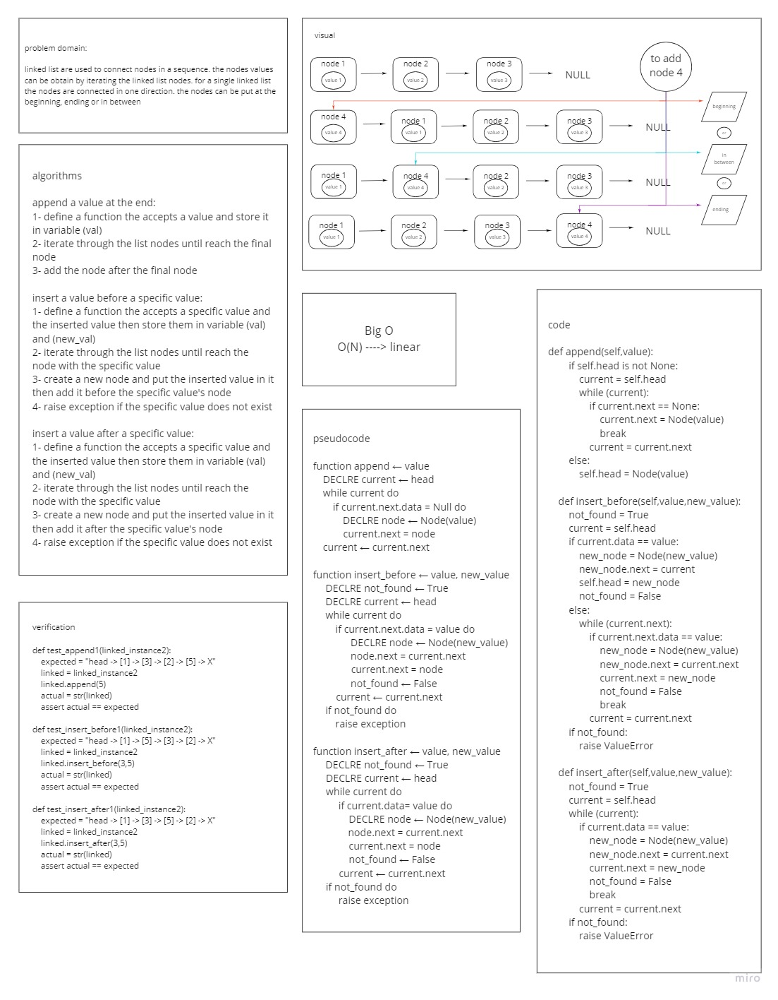

# linked list
### it is a a class used to construct a linked list data structure. it used chain nodes in a sequence

## Challenge
### the challenge was to create two classes, one for nodes and one for the linked list and test the classes API

## Approach & Efficiency
### i create the class to behave as single linked list, the nodes are connected to each other in one direction. each node pointer to the next node only. the class can add the node to the list beginning or ending and can put it before or after a wanted node. by using the node index in a linked list method, the node value can be obtained
### Big O is leniar

## Whiteboard Process

### ll-insertions

#### ll-kth-from-end

## API
#### Linked_list class:
- `__init__` the class constructor which use to create instances
- `insert` takes any value as an argument and adds a new node with that value to the head of the list with an O(1) Time performance.
- `includes` takes any value as an argument and returns a boolean result depending on whether that value exists as a Node’s value somewhere within the list.
- `__str__` takes in no arguments and returns a string representing all the values in the Linked List
- `append` takes any value as a parameter and add a new node with the given value to the end of the list
- `insert_before` takes **_value_** , **_new_value_** as parameters add a new node with the given **_new_value_** immediately before the first **_value_** node
- `insert_after` takes **_value_** , **_new_value_** as parameters add a new node with the given **_new_value_** immediately after the first **_value_** node
- `kth_from_end` takes a number **_k_**  as a parameter and return the node’s value that is **_k_** from the end of the linked list

#### Node class:
- `__init__` the class constructor which use to create instances
- `__str__` takes in no arguments and returns a string representing the node data

## Solution
#### to construct a linked list using this code then
1. instantiate an object from the Linked list class using `linked_list_instance = Linked_list()`
2. start adding the values one by one using `linked_list_instance.insert(value)`
#### to add a value in a specific place then:
- you can add a value before a specific one using `linked_list_instance.insert_before(value,new_value)`
- you can add a value after a specific one using `linked_list_instance.insert_after(value,new_value)`
- you can add a value at the list end using `linked_list_instance.append(value)`
#### to search for a value is existing in the list then:
- to search you can use `linked_list_instance.includes(searched_value)`
#### for getting the linked list values as a string then:
- to get the values you can use `str(linked_list_instance)`
#### to get the node value using the node index from the end inside the linked list then:
- to get the values you can use `kth_from_end(k_index)`

## code link
[linked_list](linked_list/linked_list.py)
