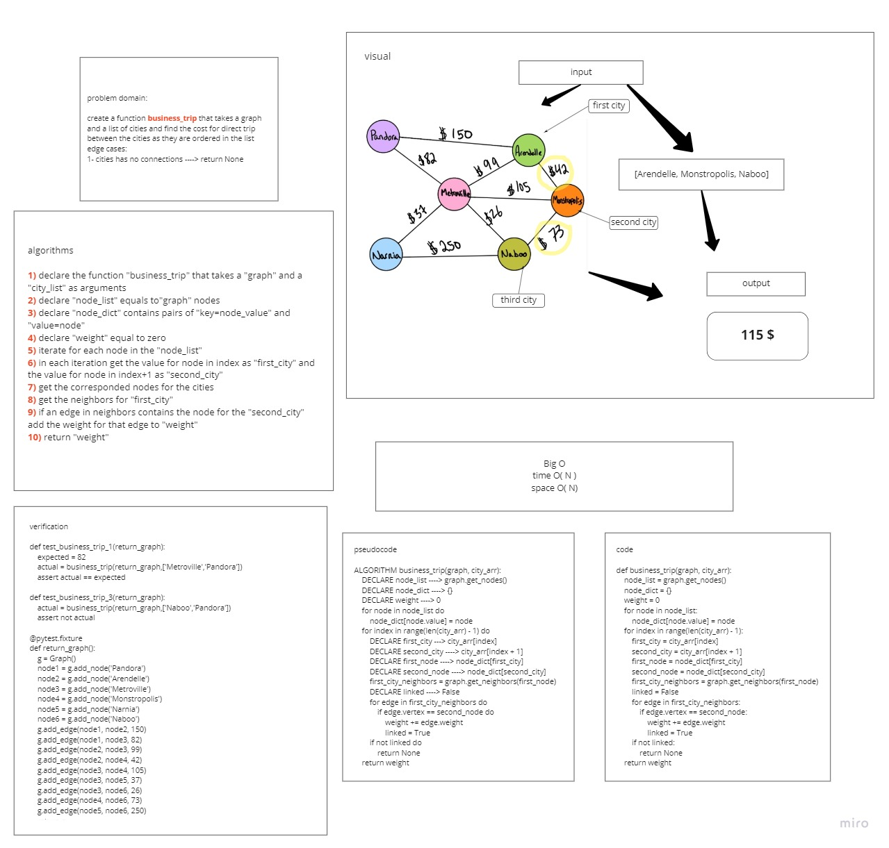

# Challenge Summary
Given a business trip itinerary, I should check for the total cost of direct trips, according to a given graph of connections between cities
## Whiteboard Process

## Approach & Efficiency
### Approach
I used nested for loops to go through the input cities, and checked for their neighbors, then I returned the sum of the weights of their edges.
### Big O
* Time: O(N)
* Space: O(N)
## Solution
To find the trip cost between two cities or more:
`business_trip(graph, [city1, city2,...])`
The return will be the total costs of the trips.
for example as in the whiteboard:
`business_trip(graph, [Metroville, Pandora, ])` => 82$

### [code](business_trip.py)
