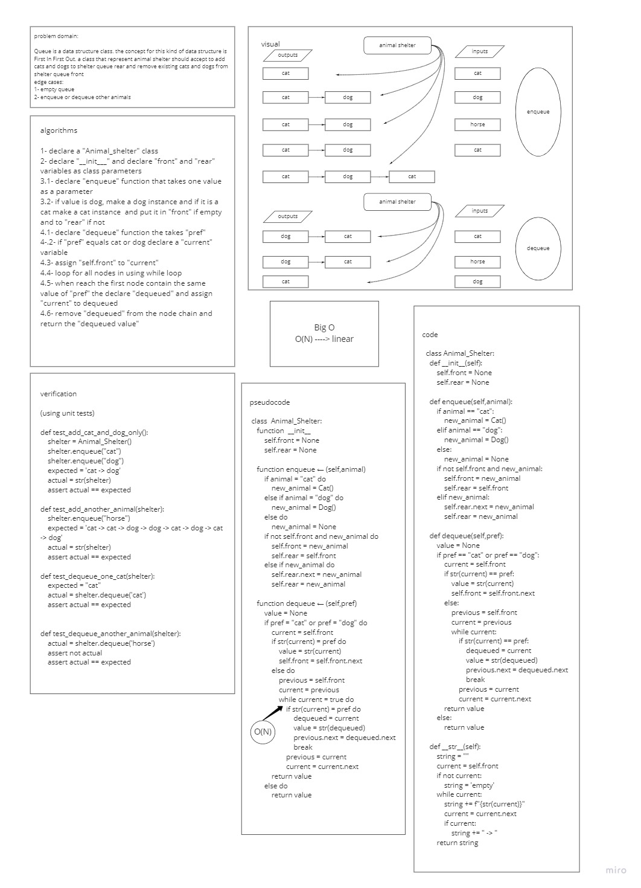

# Challenge Summary
### the challenge is to create Animal_shelter Queue to accept only dogs and cats and remove a dog or a cat as First In First Out concept only

## Whiteboard Process
### fifo-animal-shelter

## Approach & Efficiency
### i create the Animal_Shelter Queue class to add a given cat or dog object at fron if empty and if not assign the existed rear as a next to the new object and put the new object as rear, the objects are connected to each other in one direction. the removing for a cat or a dog start from the dequeue front
### Big O is N

## Solution
- Animal_Shelter:
    - to make shelter instance then `shelter = Animal_Shelter()`
    - `enqueue` takes any value as an argument and adds a new cat or dog object with that value to the back of the queue with an O(1) Time performance
        - to enqueue animal then `shelter.enqueue("cat")`
    - `dequeue` takes no argument, removes cat or dog object from the front of the queue, and returns the dequeued object value and should return `None` if the argument is not cat or dog
        - to dequeue prefered then `shelter.dequeue("cat")`

PR link https://github.com/HishamKhalil1990/data-structures-and-algorithms/pull/35
