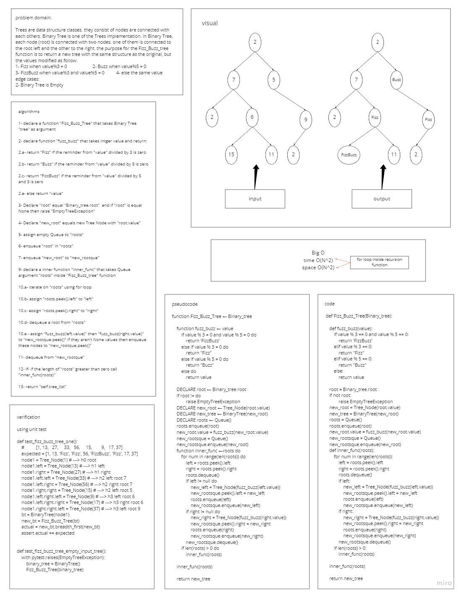

# Challenge Summary
### create a function called Fizz_Buzz_Tree that takes a Binary Tree and return a new Binary Tree with the same structure as the original, but the values modified as follows:
- If the value is divisible by 3, replace the value with “Fizz”
- If the value is divisible by 5, replace the value with “Buzz”
- If the value is divisible by 3 and 5, replace the value with “FizzBuzz”
- If the value is not divisible by 3 or 5, simply turn the number into a String.

## Whiteboard Process
### fizzbuzz-tree

## Approach & Efficiency
### i created the function to take a Binary Tree as argument, declare a new object of a Binary Tree, iterate through the input Binary Tree nodes' values, determine the modified value for them and assign these values in a new tree nodes then add them to the new Binary Tree in the same place as in the input Binary Tree and finally return the new Binary Tree
### BigO is O(N^2)

## Solution
### to modify a Binary Tree nodes' values to fizz for each value is divisible by 3, buzz for each value is divisible by 5, fizzbuzz for each value is divisible by 3 and 5 and finally return the same value if it is not divisible by 3 and 5 then:
- use the Fizz_Buzz_Tree as `Fizz_Buzz_Tree(Binary_Tree)`

PR link https://github.com/HishamKhalil1990/data-structures-and-algorithms/pull/41
