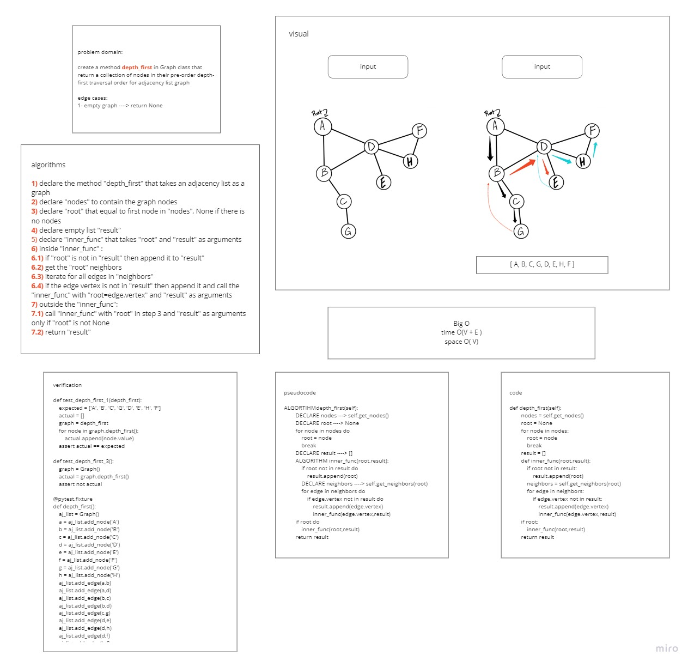
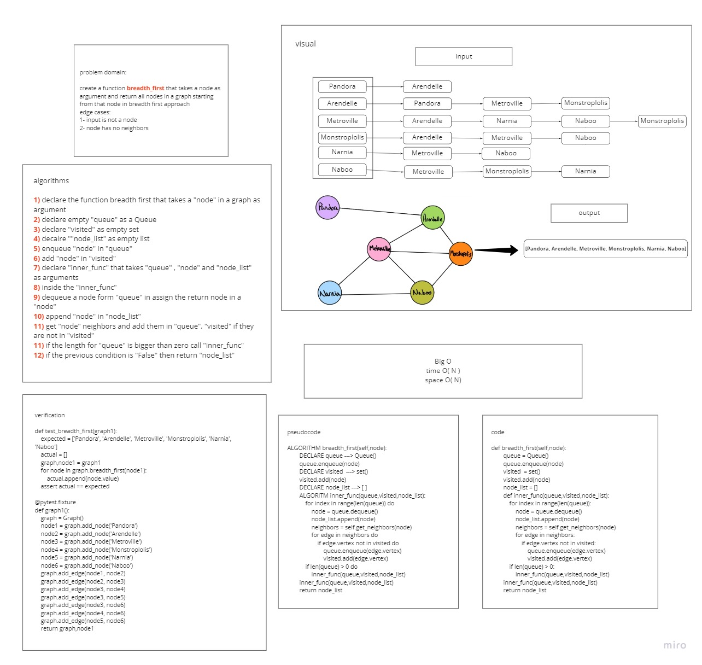

# Graphs
A graph is a non-linear data structure that can be looked at as a collection of vertices (or nodes) potentially connected by line segments named edges. the graph can retrive its nodes in multiple ways, some of them are pre-order depth fisrt and breadth first way
## Whiteboard Process
### depth first

### breadth first

## Challenge
The challenge was to create an adjacent list, which is the most common way to represent graphs and it is a collection of linked lists or array that lists all of the other vertices that are connected. It makes it easy to view if one vertices connects to another. the challenge includes:
- to return the graph nodes in breadth first approach
- to return the graph nodes in pre-order depth-first traversal approach.
## Approach & Efficiency
### Approach
Each node is stored in a different linked list and each linked list is sorted in the adjacency list array.
Each node has a value and edges.
Edges represent the relation between nodes:
### Big O(N)
#### Efficiency for depth first
* Time: O(V + E)
* Space: O(V)
#### Efficiency for breadth first
* Time: O(N)
* Space: O(N)
## API
The function:
* Adds a node.
* Adds an edge.
* Gets all the nodes.
* Gets the neighbors of an input node.
* Gets the size of the graph.
* Gets nodes in breadth first approach

## Solution
### to return the nodes in a graph as pre-order depth fisrt approach then:
- use `graph.depth_first()`
### to return all nodes after a specific node in a graph as breadth first approach then:
- use `graph.breadth_first(node)`

### [code](graph.py)
### [PR](https://github.com/HishamKhalil1990/data-structures-and-algorithms/pull/54)
