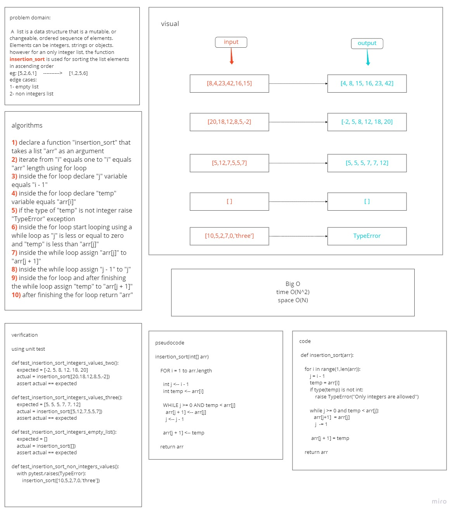

# Challenge Summary
<!-- Description of the challenge -->
### Create a function that takes a list with integer values items and sort its items in ascending order based on their values

## Whiteboard Process
<!-- Embedded whiteboard image -->

## Approach & Efficiency
<!-- What approach did you take? Why? What is the Big O space/time for this approach? -->
### I created the function to take a list, then iterates for its items to sort them in ascending order if their values are integers and raise a TypeError exception if there is at least one item is not an integer
### BigO for time is O(N^2)
### BigO for space is O(N)

## Solution
<!-- Show how to run your code, and examples of it in action -->
### to sort list items with intgers values then:
- insert the list as argument in inseration_sort as `inseration_sort(arr)`
### to run tests then:
- for tests in **test_insertion_sort.py** run `pytest tests/test_insertion_sort.py`
### [code](insertion_sort.py)
### [PR-link](https://github.com/HishamKhalil1990/data-structures-and-algorithms/pull/42)
