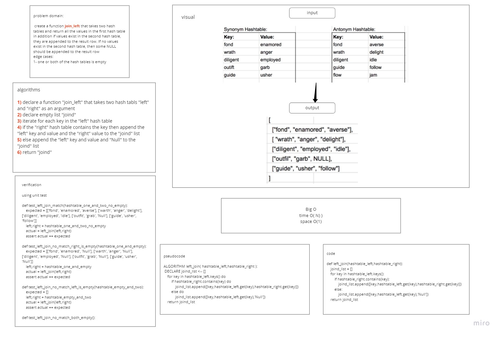

# Hashmap LEFT JOIN
<!-- Short summary or background information -->
### create a function the takes two hash maps and join the values from the right hash map to the key and value for the left hash map only if the key exists in the left hash map
## Challenge
<!-- Description of the challenge -->
### Each table should has key and value. We should return as a result one array that contains all keys in the left hash map and values in both hash maps if the key exists in the left hash map. if the key does not exist in the right hash map, fill the no match with null.
## Approach & Efficiency
<!-- What approach did you take? Why? What is the Big O space/time for this approach? -->
### i created the function to iterate on the left hash map keys and looks if the key exists in the right hash map. if it does combine the right hash map value with the key and the value of the left hash map else combine Null with the key and the value of the left hash map
### Time: O(N)
### Space: O(1)
## Solution
<!-- Embedded whiteboard image -->

### [code](left_join.py)
### [PR](https://github.com/HishamKhalil1990/data-structures-and-algorithms/pull/49)
