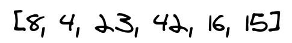
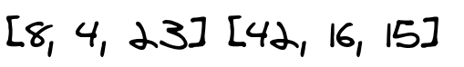
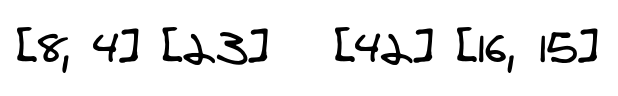
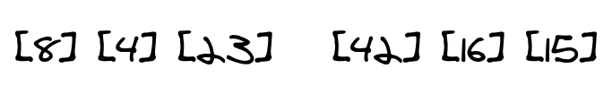
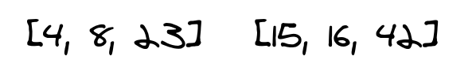
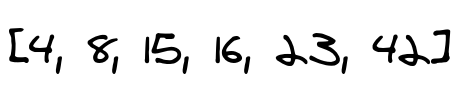

# Merge Sort
## The original Input

## The first step

Here we split the original list into two parts and re-call the merge-sort function again two times. in the first one we pass the list in the right and in the second we pass the the list in the left
## The Second step

we split both lists from first step into two lists for each and re-call the merge-sort function again. however now we re-call four tims. one call for each list
## The Third step

we split only lists with more than one value from second step into two lists for each list. now we start passing each right and left form this step and above. the last two splitted lists in this step will start merging because each one has a left and right then each merged list will merge with one from the above level
## The Fourth step

finally we have two lists as a result from merging from down to above. these two lists will be passed with the original list to be merged into one sorted list
## The Fifth step

in this step. the two lists from step four merged and sorted into one single list and returned.

### [PR-link](https://github.com/HishamKhalil1990/data-structures-and-algorithms/pull/43)
