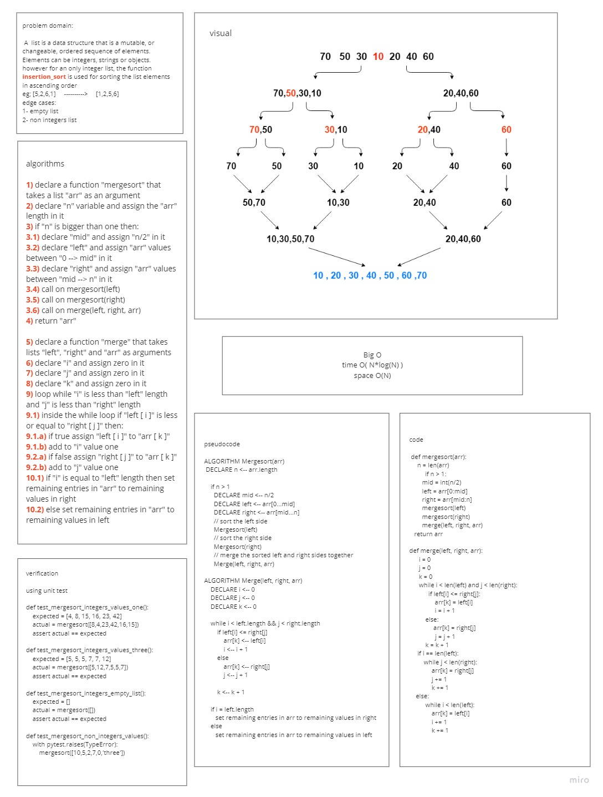

# Challenge Summary
<!-- Description of the challenge -->
### Create a function that takes a list with integer values items and sort its items in ascending order based on their values using merge sort approach

## Whiteboard Process
<!-- Embedded whiteboard image -->

## Approach & Efficiency
<!-- What approach did you take? Why? What is the Big O space/time for this approach? -->
### I created the function to take a list, divide it into two lists (left and right), re-call itself, one passing the left list and one passing the right list and finally call the merge function passing left, right and the original list to merge all parts and sort them in ascending order if all values are integers and raise a TypeError exception if there is at least one item is not an integer
### BigO for time is O(N*logN)
### BigO for space is O(N)

## Solution
<!-- Show how to run your code, and examples of it in action -->
### to sort list items with intgers values then:
- insert the list as argument in mergesort as `mergesort(arr)`
### to run tests then:
- for tests in **test_insertion_sort.py** run `pytest --verbose tests/test_merge_sort.py`
### [code](merge_sort.py)
### [PR-link](https://github.com/HishamKhalil1990/data-structures-and-algorithms/pull/43)
