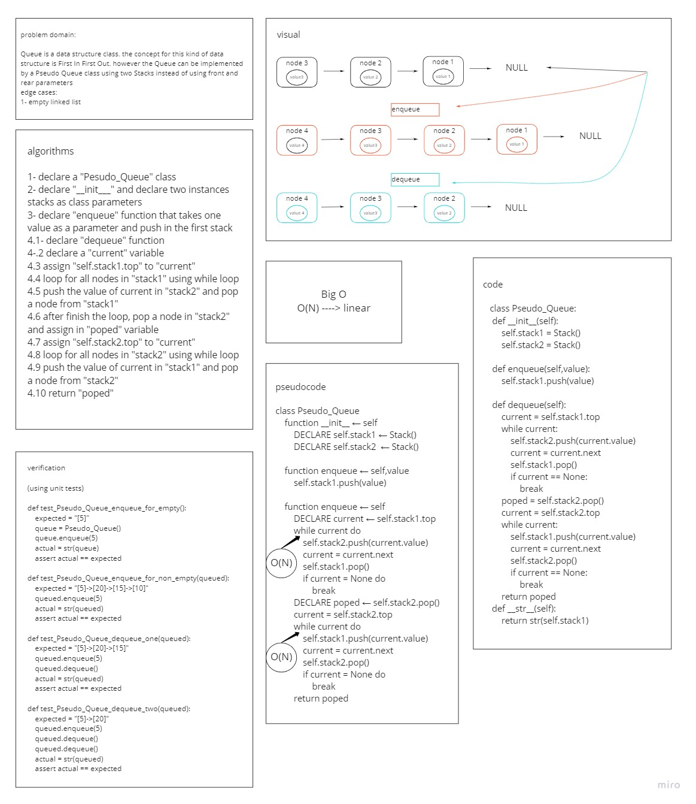

# Challenge Summary
### the challenges is to build a Queue data structure behavior for a Pseudo Queue class using two Stacks instead of using front and rear parameters as in Queue. the results of enqueue and dequeue in the Pseudo Queue should be identical for the same process in Queue

## Whiteboard Process
### queue with stacks

## Approach & Efficiency
### i created a class Pseudo_Queue which can enqueue a value by createing a node, passing the value to the node and add it to the first stack also it can dequeue nodes from the first entered nodes
### the Big O is 0(N)

## Solution
- Pseudo_Queue:
    - `enqueue` takes any value as an argument and adds a new node with that value to the back of the queue with an O(1) Time performance.
    - `dequeue` takes no argument, removes the node from the front of the queue, and returns the node’s value and should raise exception when called on empty queue

[queue-with-stacks](queue_with_stacks/queue_with_stacks.py)

PR link https://github.com/HishamKhalil1990/data-structures-and-algorithms/pull/34
