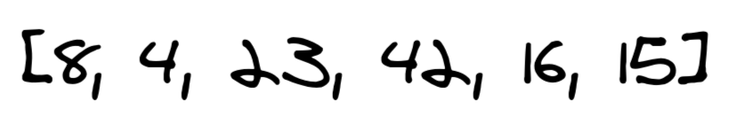
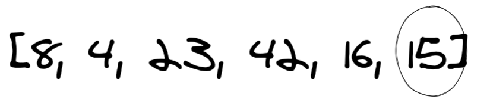
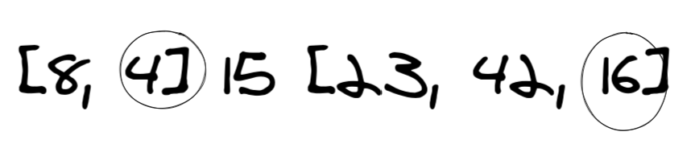
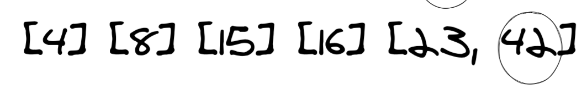
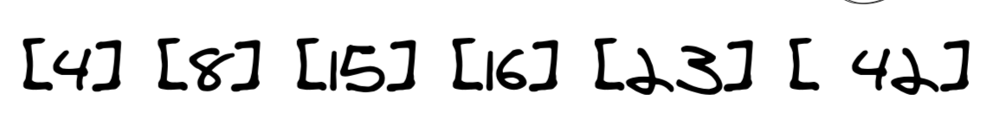
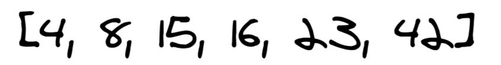

# Quick Sort
## The original Input

## The first step

Here we assigned "15" as the pivot. then divide the array to three arrays, one for numbers above the pivot and one for the lower numbers and the last one for the pivot
## The Second step

the left array conatins "8" and "4" with a pivot of "4" and the right array conatins "16", "23", "42" with a pivot of "16" so we divided both arrays as what we did in the previous step. we end up with five arrays
## The Third step

in this step we have one array that can be divided into two with a pivot of "42"
## The Fourth step

now all numbers are in separte lists and then we swap between the numbers to sort them in ascending order
## The Fifth step

finally we merge the sorted lists into one single list and return it.
