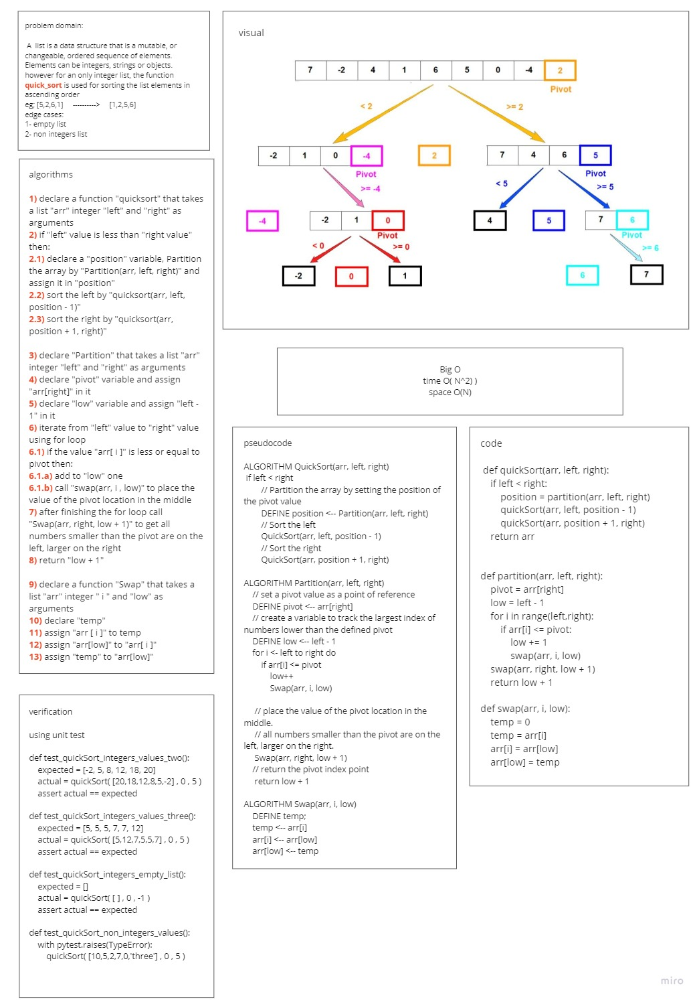

# Challenge Summary
<!-- Description of the challenge -->
### Create a function that takes a list with integer values items and sort its items in ascending order based on their values using quick sort approach

## Whiteboard Process
<!-- Embedded whiteboard image -->

## Approach & Efficiency
<!-- What approach did you take? Why? What is the Big O space/time for this approach? -->
### i created the function to take a list, integer as left and integer as right then partition the last using a partition function and call itself to sort the left then call itself again to sort the right. the function sorts the list using recursion approach
### BigO for time is O(N^2)
### BigO for space is O(N)

## Solution
<!-- Show how to run your code, and examples of it in action -->
### to sort list items with intgers values then:
- insert (list, left = 0 and right = list length - 1) as arguments in quickSort as `quickSort(arr,0,len(arr)-1)`
### to run tests then:
- for tests in **test_insertion_sort.py** run `pytest --verbose tests/test_quick_sort.py`
### [PR-link](https://github.com/HishamKhalil1990/data-structures-and-algorithms/pull/44)
### [code](quick_sort.py)
