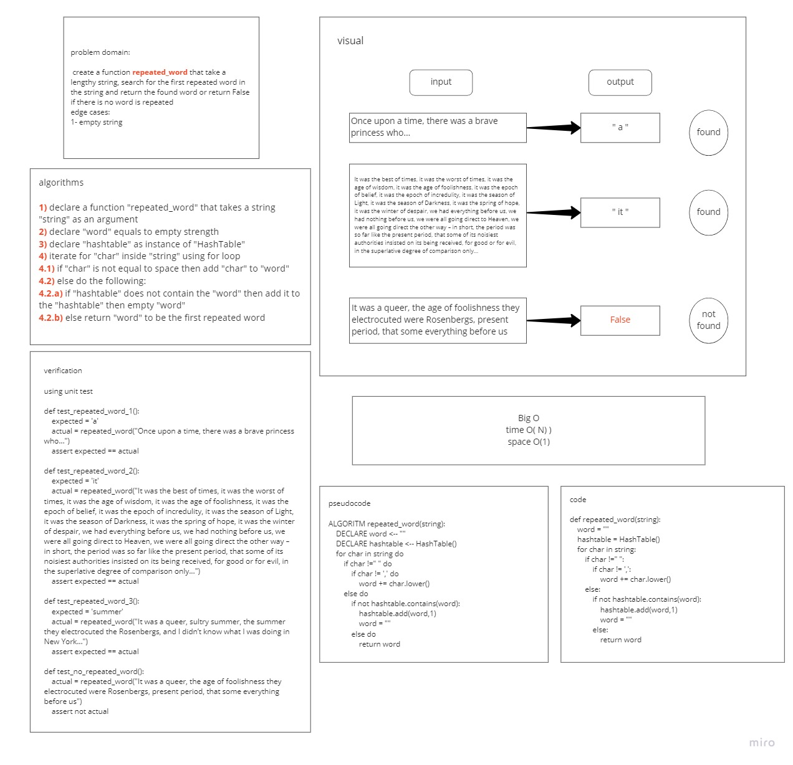

# Repeated word
### create a function that can find and return the first repeated word in a lengthy string if it exists or return `False` if it does not
## Whiteboard Process

## Approach & Efficiency
### i created the function to iterate for each char inside the string to make a word then inside this loop iterate again to make a comparison word. for each word, it will be compared with all string words to find if it is repeated or not and find the place for the repetition
Time= O(N^2)
space = O(1)
## Solution
### to find the first repeated word then:
- use the function repated_word as `repated_word(string)`
### to apply tests then:
- use `pytest --verbose  tests/test_repeated_word.py`

### [code](repeated_word.py)
### [PR]()
