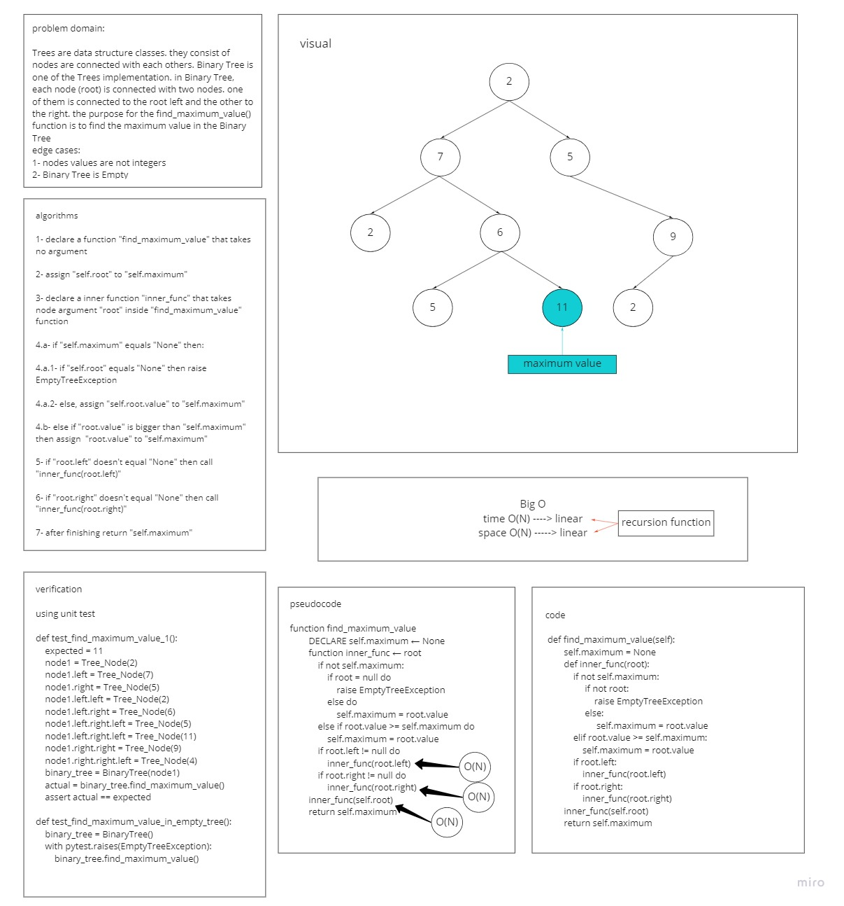
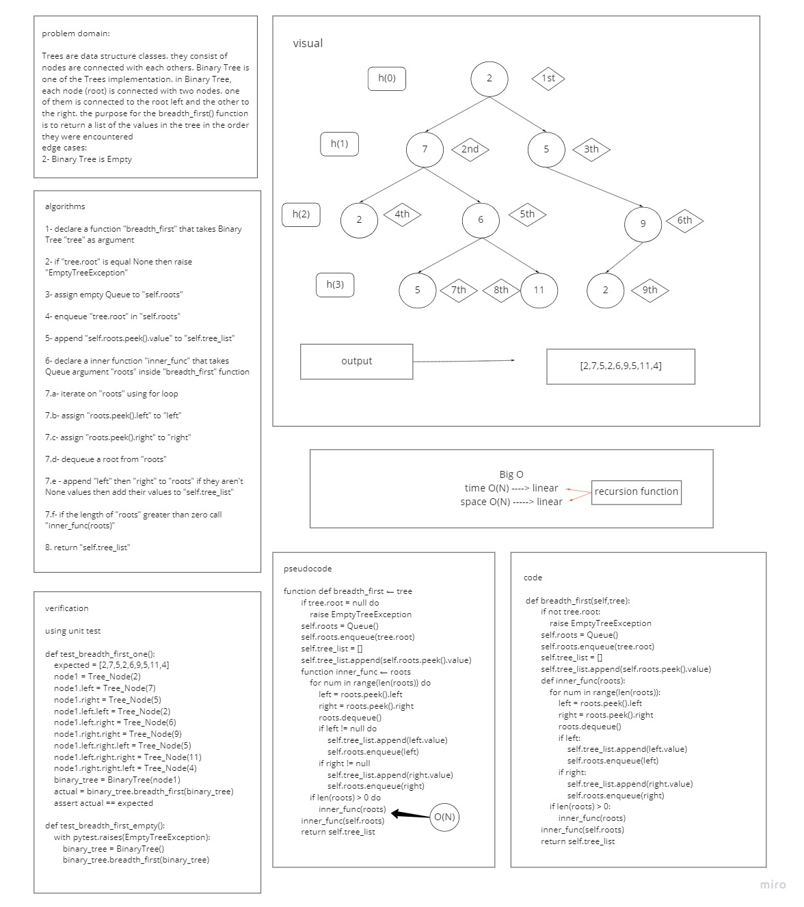

# Trees
### Trees consists of nodes which are connected with each other. there are several kinds of trees. two of them are the binary tree and the binary search tree. binary Trees restrict the number of children to two which are the left and the right children. there is no specific sorting order for a binary tree. binary Search Tree (BST) is a type of tree that does have some structure attached to it. In a BST, nodes are organized in a manner where all values that are smaller than the root are placed to the left, and all values that are larger than the root are placed to the right.

## Whiteboard Process
### find-maximum-value

### breadth-first

## Challenge
### the challenge is to create a binary tree class that can return a collection from a preorder traversal, a collection from an inorder traversal and collection from a postorder traversal. also to create a binary search tree that can add a node in its correct location and search for a given value through tree nodes

## Approach & Efficiency
### i created the binary tree class to traversals the tree nodes using depth first process in three methods which are:
- Pre-order: `root >> left >> right`
- In-order: `left >> root >> right`
- Post-order: `left >> right >> root`
### also the Binary Tree can determine the maximum values in the Tee's nodes.
### i created the binary search tree to add a node in to the left if the enterd value is less then the root value -if left is empty- if not go to the left node and repeat the process and add a node to the right if the enterd value is bigger then the root value -if right is empty- if not go to the right node and repeat the process

## API
<!-- Description of each method publicly available in each of your trees -->
- Binary Tree:
    - `pre_order()`return a collection from a preorder traversal
    - `in_order()` return a collection from an inorder traversal
    - `post_order()` return a collection from a postorder traversal
    - `find_maximum_value()` return the maximum value in a Binary Tree
    - `breadth_first(binary_tree)` returns return a list of the values in the tree in the order they were encountered.
- Binary Search Tree:
    - `add(value)` accepts a value, and adds a new node with that value in the correct location in the binary search tree
    - `contains(value)` accepts a value, and returns a boolean indicating whether or not the value is in the tree at least once

## PR https://github.com/HishamKhalil1990/data-structures-and-algorithms/pull/40

[code](tree/tree.py)
