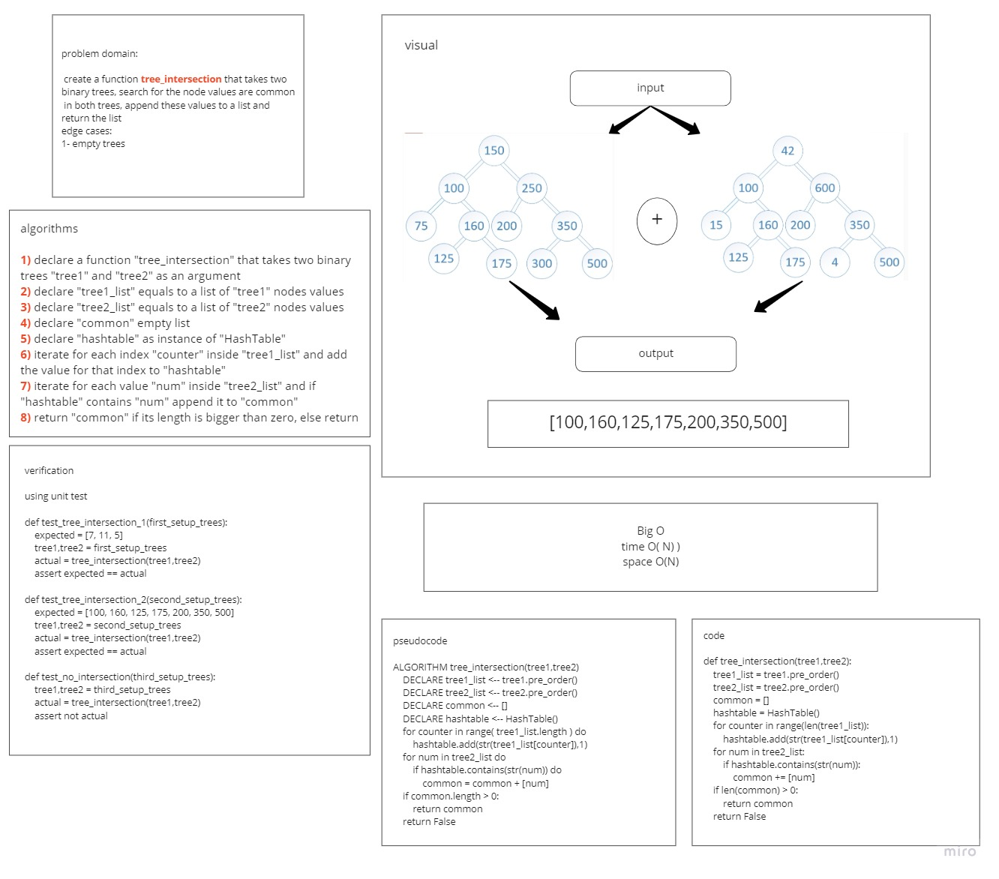

# Challenge Summary
<!-- Description of the challenge -->
### create a function that can find and return all common node values in two Binary Trees. the function return will be a list type contains all the values found

## Whiteboard Process

## Approach & Efficiency
<!-- What approach did you take? Why? What is the Big O space/time for this approach? -->
### i create the function to use hashtable to save all node values for the first tree, search for key existance using values from the second tree, save the found keys in a list and return the list

## Solution
<!-- Show how to run your code, and examples of it in action -->
### to search for common node values inside two trees then:
- use the tree_intersection as `tree_intersection(tree1,tree2)`
### to run all tests then
- use `pytest --verbose tests/test_tree_intersection.py`

### [code](tree_intersection.py)
### [PR link](https://github.com/HishamKhalil1990/data-structures-and-algorithms/pull/48)
